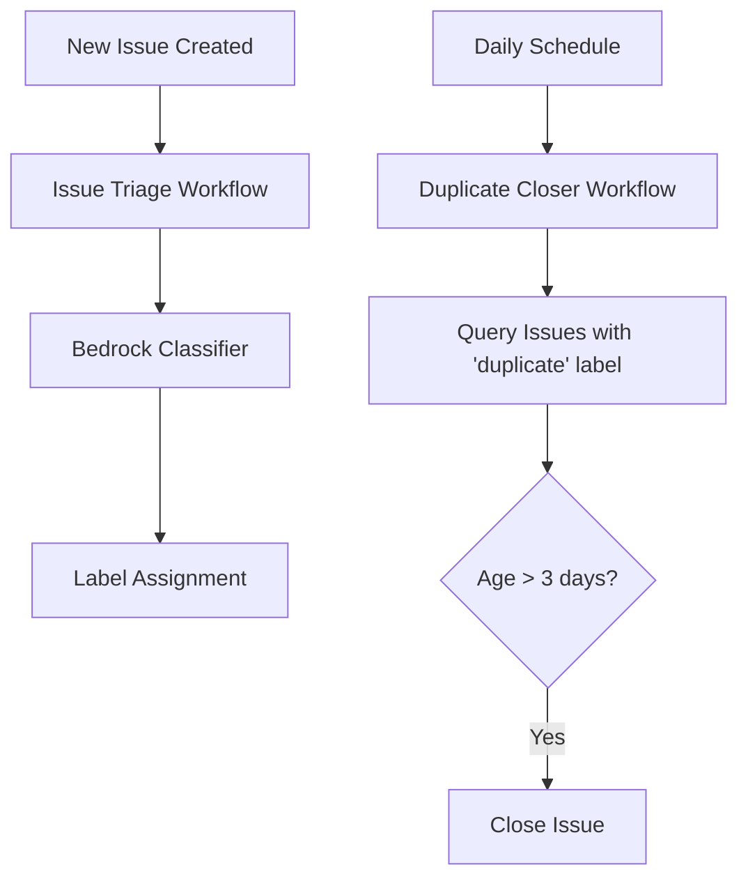

# Spec-Driven Development Workflows on GitHub — Research

**Compiled:** 2026-06-22
**Method:** One subagent researched each repo against primary sources (the repo's own files, embedded templates, and official docs). Star counts pulled live from the GitHub API on 2026-06-22. Where a repo ships only a template (not a filled-in example), the example below reproduces the real template and labels any constructed fill-in.

For each tool you get two things: **(1)** its spec workflow — the phases, commands, and artifacts; **(2)** an example of what a *final spec* looks like.

---

## At a glance

| # | Tool (stars) | Workflow phases | Spec artifact(s) | Spec format style |
|---|---|---|---|---|
| 1 | [spec-kit](#1-githubspec-kit) (114.8k) | constitution → specify → clarify → plan → tasks → analyze → implement | `spec.md` (+ plan/research/tasks) | Prioritized user stories, `FR-NNN`, `SC-NNN`, `[NEEDS CLARIFICATION]`; tech-agnostic |
| 2 | [get-shit-done / GSD](#2-gsd-buildget-shit-done-gsd) (64.4k) | new-project → spec-phase → discuss → plan → execute (waves) → verify → ship | `NN-SPEC.md` + atomic `PLAN.md` | Ambiguity-gated spec (≤0.20) + YAML-frontmatter atomic plans |
| 3 | [OpenSpec](#3-fission-aiopenspec) (56.0k) | propose → continue/ff → apply → verify → archive | Canonical `spec.md` + **delta specs** | RFC-2119 SHALL; `### Requirement` + `#### Scenario` WHEN/THEN; ADDED/MODIFIED/REMOVED deltas |
| 4 | [BMAD-METHOD](#4-bmad-code-orgbmad-method) (49.5k) | analysis → planning (PRD) → solutioning (arch + sharded stories) → implementation | PRD → `ARCHITECTURE-SPINE.md` → per-story files | Persona-authored; story = As-a/I-want/so-that + AC + tasks |
| 5 | [ccpm](#5-automazeioccpm) (8.2k) | PRD → parse to epic → decompose tasks → sync to GitHub Issues → execute | `prd.md` → `epic.md` → numbered tasks | Frontmatter + body; PM/issue-driven, ≤10 tasks, full traceability |
| 6 | [Backlog.md](#6-mrleskbacklogmd) (5.8k) | create → In Progress (+plan, approval gate) → implement → Done | Task `.md` file | YAML frontmatter + Description / AC checkboxes / Plan / Notes |
| 7 | [potpie](#7-potpie-aipotpie) (5.5k) | explore code graph → clarify (MCQ) → generate spec → refine | Generated `# Technical Specification` markdown | Agent-generated from a code knowledge graph; loosely spec-driven |
| 8 | [agent-os](#8-buildermethodsagent-os) (4.9k) | plan-product → create-spec → create-tasks → execute-tasks | `spec.md` + `spec-lite.md` + sub-specs | Overview / User Stories / Spec Scope / Out of Scope / Expected Deliverable |
| 9 | [spec-workflow-mcp](#9-pimzinospec-workflow-mcp) (4.2k) | (steering) → requirements → design → tasks → implement, each human-approved | `requirements.md` + `design.md` + `tasks.md` | EARS criteria (WHEN…THEN…SHALL); tasks carry `_Leverage:_`/`_Requirements:_`/`_Prompt:_` |
| 10 | [Kiro](#10-kirodotdevkiro) (3.9k) | requirements → design → tasks → execute (waves), each gated | `requirements.md` + `design.md` + `tasks.md` | EARS (WHEN…THE SYSTEM SHALL…); tasks `_Requirements: x.y_` back-refs |

**Two big patterns jump out:**

1. **The dominant shape is three docs: requirements → design → tasks.** Kiro pioneered it; spec-workflow-mcp, agent-os, and OpenSpec all converge on the same split (the *what* stays separate from the *how*). EARS notation (`WHEN <event> THE SYSTEM SHALL <response>`) is the de-facto requirements grammar.
2. **Two camps differ on what "spec" means.** Most treat the spec as a tech-agnostic statement of intent (spec-kit, Kiro, OpenSpec). The PM-oriented tools (ccpm, Backlog.md) treat it as a trackable work item synced to issues/boards. potpie is the outlier — its "spec" is generated by an agent from a code knowledge graph, not authored by you.

---

## 1. github/spec-kit

Spec Kit is GitHub's spec-driven development (SDD) toolkit. It installs a `specify` CLI plus a set of agent slash-commands (`/speckit.*`) into a project. The methodology treats the specification as the source of truth and code as the generated output that serves the spec.

### Spec workflow

Two layers drive the flow: a terminal `specify` CLI bootstraps a project, then `/speckit.*` slash-commands (run inside your AI agent) drive each phase. Each command seeds or fills a file artifact.

CLI (terminal):
- `specify init <project> --integration copilot` — bootstrap a project with Spec Kit artifacts (also `specify init . --force` to merge into the current dir).
- `specify self check` / `specify self upgrade [--dry-run]` — release checks and in-place upgrade.

Slash-commands, in recommended order:

| Order | Command | What it does | Artifact produced |
|---|---|---|---|
| 1 | `/speckit.constitution` | Set governing principles / dev guidelines | `.specify/memory/constitution.md` |
| 2 | `/speckit.specify` | Describe what to build (requirements, user stories) | `specs/<NNN-feature-name>/spec.md` |
| 3 | `/speckit.clarify` | Resolve underspecified areas (recommended before plan) | Clarifications added to `spec.md` |
| 4 | `/speckit.plan` | Technical plan for chosen stack | `plan.md` + `research.md`, `data-model.md`, `contracts/`, `quickstart.md` |
| 5 | `/speckit.tasks` | Break plan into actionable, parallelizable tasks | `specs/<NNN-feature-name>/tasks.md` |
| 6 | `/speckit.analyze` | Cross-artifact consistency & coverage check | Analysis report (no fixed file) |
| 7 | `/speckit.implement` | Execute the tasks to build the feature | Working code |

Optional commands: `/speckit.checklist` (quality checklists), `/speckit.converge`, `/speckit.taskstoissues` (push tasks to GitHub issues).

Each feature gets its own folder under `specs/`. A completed feature folder looks like:

```
specs/003-chat-system/
├── spec.md          # /speckit.specify
├── plan.md          # /speckit.plan
├── research.md      # /speckit.plan
├── data-model.md    # /speckit.plan
├── contracts/       # /speckit.plan
├── quickstart.md    # /speckit.plan
└── tasks.md         # /speckit.tasks
```

**Important distinction:** in spec-kit the **spec** (`spec.md`) is intentionally the *what/why* — user stories, requirements, success criteria — and stays technology-agnostic. The *how* (stack, architecture, APIs) lives in `plan.md`. So the "spec" is NOT the plan.

### Example final spec

The repo ships the **template** (`templates/spec-template.md`); it does not ship a filled-in production spec.

**(A) Actual template — `templates/spec-template.md`** (headings verbatim, condensed):

```markdown
# Feature Specification: [FEATURE NAME]
**Feature Branch**: `[###-feature-name]`
**Created**: [DATE]
**Status**: Draft
**Input**: User description: "$ARGUMENTS"

## User Scenarios & Testing *(mandatory)*
### User Story 1 - [Brief Title] (Priority: P1)
**Why this priority**: ...
**Independent Test**: ...
**Acceptance Scenarios**:
1. **Given** [state], **When** [action], **Then** [outcome]
### Edge Cases
- What happens when [boundary condition]?

## Requirements *(mandatory)*
### Functional Requirements
- **FR-001**: System MUST [capability]
- **FR-006**: System MUST authenticate users via [NEEDS CLARIFICATION: auth method?]
### Key Entities *(include if feature involves data)*
- **[Entity 1]**: [what it represents, key attributes]

## Success Criteria *(mandatory)*
### Measurable Outcomes
- **SC-001**: [measurable, tech-agnostic metric]

## Assumptions
- [Assumption about users / scope / dependencies]
```

Conventions: user stories are prioritized (P1/P2/P3) and each must be independently testable; requirements use `FR-NNN` IDs; ambiguities are flagged inline with `[NEEDS CLARIFICATION: …]`; success criteria use `SC-NNN` and must be measurable and tech-agnostic.

**(B) Faithful filled-in example** (constructed to match the template, illustrative):

```markdown
# Feature Specification: Real-Time Chat System
**Feature Branch**: `003-chat-system`
**Created**: 2026-06-22
**Status**: Draft
**Input**: User description: "Real-time chat with message history and user presence"

## User Scenarios & Testing *(mandatory)*
### User Story 1 - Send and receive messages live (Priority: P1)
A signed-in user opens a room, types a message, and other members see it immediately.
**Why this priority**: Live messaging is the core value; without it there is no product.
**Independent Test**: Open two sessions in one room; a message sent from A appears for B within 1s.
**Acceptance Scenarios**:
1. **Given** two users in room R, **When** user A sends "hi", **Then** user B sees "hi" within 1 second.
2. **Given** a user with no network, **When** they send a message, **Then** it queues and sends on reconnect.

### Edge Cases
- What happens when a message exceeds the max length?
- How does the system handle a user who disconnects mid-send?

## Requirements *(mandatory)*
### Functional Requirements
- **FR-001**: System MUST deliver new messages to all room members in real time.
- **FR-002**: System MUST persist message history and load the last 50 on room open.
- **FR-003**: Users MUST be able to see which members are currently online.
- **FR-004**: System MUST retain message history for [NEEDS CLARIFICATION: retention period not specified].

### Key Entities *(include if feature involves data)*
- **Message**: sender, room, body, timestamp.
- **Room**: name, member list, creation time.
- **Presence**: user, room, online/offline state, last-seen.

## Success Criteria *(mandatory)*
### Measurable Outcomes
- **SC-001**: 95% of messages are visible to recipients within 1 second.
- **SC-002**: System sustains 1,000 concurrent users per room without degradation.

## Assumptions
- Users authenticate through the existing account system.
- Mobile-native clients are out of scope for v1 (web only).
```

**Sources:** `templates/spec-template.md`, `spec-driven.md`, `docs/reference/workflows.md`, `README.md`, `scripts/bash/create-new-feature.sh` (all `@main`).

---

## 2. gsd-build/get-shit-done (GSD)

GSD is a meta-prompting, context-engineering, and spec-driven development system for Claude Code (by TÂCHES). The work model: break a project into milestones → phases, then break each phase into **atomic plans** that each run in their own fresh ~200k-token context window via a dedicated subagent.

*Provenance note:* the canonical README is now a redirect stub ("GSD Has Moved" → `open-gsd/gsd-core`), but `gsd-build/get-shit-done@main` still contains the full working command/template set used below.

### Spec workflow

Artifacts live under a per-project `.planning/` directory. Commands are slash-commands namespaced `gsd:` (canonical frontmatter `name:` is `gsd:<cmd>`; docs also show `/gsd-<cmd>`).

1. **`/gsd:new-project`** — Bootstraps. Creates `.planning/PROJECT.md`, `REQUIREMENTS.md`, `ROADMAP.md`, `STATE.md`, `config.json`, optional `research/`.
2. **`/gsd:spec-phase [N]`** — Socratic interview (up to 6 rounds, rotating perspectives: Researcher, Simplifier, Boundary Keeper). Gates on an **ambiguity score ≤ 0.20** before passing. Output: `{phase_dir}/{NN}-SPEC.md`.
3. **`/gsd:discuss-phase [N]`** — Captures implementation decisions ("how") before planning → `CONTEXT.md`.
4. **`/gsd:ui-phase [N]`** (frontend only) — design contract `XX-UI-SPEC.md`.
5. **`/gsd:plan-phase [N]`** — spawns parallel researchers → `RESEARCH.md`, then the `gsd-planner` agent emits **atomic execution plans** (`XX-YY-PLAN.md`), verified by a `gsd-plan-checker` loop. Plans carry **wave numbers** for parallelization and **must_haves** (observable success criteria).
6. **`/gsd:execute-phase [N]`** — groups plans into **waves** and spawns one fresh executor subagent per plan. Wave 1 (no conflicts/deps) runs simultaneously; Wave 2 waits. Each task commits atomically. Output: `XX-YY-SUMMARY.md` + `VERIFICATION.md`.
7. **`/gsd:verify-work [N]`** → `UAT.md`. **`/gsd:ship [N]`** → opens a PR. **`/gsd:audit-milestone` → `/gsd:complete-milestone`** archive + tag.

"Atomic" = a self-contained unit one executor completes and commits in a single pass. Vertical slices (model + API + UI for one feature) are preferred over horizontal layers.

### Example final spec

Two artifacts matter: the **SPEC** (locks what/why) and the **atomic PLAN** (executable how).

**A) SPEC template — verbatim from `get-shit-done/templates/spec.md`** (abridged):

```markdown
# Phase [X]: [Name] — Specification

**Created:** [date]
**Ambiguity score:** [score] (gate: ≤ 0.20)
**Requirements:** [N] locked

## Goal
[One precise, measurable sentence — "X changes from A to B", not "improve X".]

## Background
[Current state from the codebase — what exists, what's broken, what triggers this work.]

## Requirements
1. **[Short label]**: [Specific, testable statement.]
   - Current: [what exists / does NOT exist today]
   - Target: [what it should become]
   - Acceptance: [concrete pass/fail check a verifier confirms]

## Boundaries
**In scope:** - [concrete deliverable]
**Out of scope:** - [excluded item] — [reason]

## Acceptance Criteria
- [ ] [Unambiguous pass/fail criterion]

## Ambiguity Report
| Dimension | Score | Min | Status | Notes |
|---|---|---|---|---|
| Goal Clarity | | 0.75 | | |
| **Ambiguity** | | ≤0.20 | | |
```

**B) Atomic PLAN format — verbatim from `get-shit-done/templates/phase-prompt.md`** (YAML frontmatter + XML task):

```yaml
---
phase: XX-name
plan: NN
type: execute
wave: N
depends_on: []
files_modified: []
autonomous: true
requirements: []
must_haves:
  truths: []
  artifacts: []
  key_links: []
---
```
```xml
<task type="auto">
  <name>Task 1: [Action-oriented name]</name>
  <files>path/to/file.ext</files>
  <read_first>path/to/source-of-truth.ext</read_first>
  <action>[Concrete implementation: exact identifiers, params, paths.]</action>
  <verify>[Command/check that proves it worked]</verify>
  <acceptance_criteria>
    - [Grep-verifiable: "file.ext contains 'exact string'"]
  </acceptance_criteria>
</task>
```

**C) Faithful filled-in PLAN** (constructed to match the format):

```yaml
---
phase: 03-auth
plan: 01
type: execute
wave: 1
depends_on: []
files_modified: [src/auth/session.ts, tests/auth/session.test.ts]
autonomous: true
requirements: [REQ-3, REQ-5]
must_haves:
  truths: ["Expired sessions return 401, not 500"]
  artifacts: ["src/auth/session.ts exports validateSession()"]
  key_links: ["login route calls validateSession before issuing cookie"]
---
```
```xml
<task type="auto">
  <name>Task 1: Add expiry check to validateSession()</name>
  <files>src/auth/session.ts</files>
  <read_first>src/auth/types.ts, .planning/phases/03-auth/03-SPEC.md</read_first>
  <action>In validateSession(), after decoding the JWT, compare exp to Date.now()/1000. If exp < now, throw SessionExpiredError (maps to HTTP 401). Do NOT return null — callers treat null as 500.</action>
  <verify>npm test tests/auth/session.test.ts</verify>
  <acceptance_criteria>
    - tests/auth/session.test.ts contains "returns 401 on expired token"
    - session.ts throws SessionExpiredError, NOT returns null
  </acceptance_criteria>
</task>
```

**Sources (all `@main`):** `docs/USER-GUIDE.md`, `get-shit-done/templates/spec.md`, `get-shit-done/templates/phase-prompt.md`, `commands/gsd/{new-project,spec-phase,plan-phase,execute-phase}.md`.

---

## 3. Fission-AI/OpenSpec

OpenSpec keeps AI coding assistants aligned to agreed requirements *before* code is written. Central idea: separate **specs** (stable source of truth for current behavior) from **change proposals** (isolated, reviewable folders). Changes merge into the specs only when archived. The repo dogfoods itself — its own `openspec/` directory holds real specs and proposals.

### Spec workflow

**Two core concepts:**
- **Spec** — a behavior contract, not an implementation plan. Lives in `openspec/specs/<capability>/spec.md`. Uses RFC-2119 keywords (SHALL/MUST/SHOULD/MAY). Rule of thumb: "If implementation can change without changing externally visible behavior, it likely does not belong in the spec."
- **Change proposal** — a folder under `openspec/changes/<change-name>/` packaging one modification in isolation.

**The four artifacts each change produces:**
1. `proposal.md` — why and what's changing.
2. `design.md` — technical approach (optional; non-trivial changes).
3. `specs/<capability>/spec.md` — **delta specs** describing requirement changes.
4. `tasks.md` — numbered implementation checklist.

**Delta specs** are the heart of the flow. Inside a change, spec files declare only what changes, under operation headers: `## ADDED Requirements`, `## MODIFIED Requirements`, `## REMOVED Requirements`, `## RENAMED Requirements`. On archive, these merge into canonical `openspec/specs/`.

**Lifecycle: Draft → Applied → Archived.**

```
openspec/
  AGENTS.md                      # instructions/templates for AI agents
  specs/                         # source of truth (current behavior)
    <capability>/spec.md
  changes/                       # in-flight proposals (isolated)
    add-global-install-scope/
      proposal.md / design.md / tasks.md
      specs/<capability>/spec.md # delta spec
    archive/                     # completed, date-prefixed
```

**Slash commands** (two profiles via `openspec config profile`): modern `/opsx:` (`propose`, `explore`, `ff`, `apply`, `verify`, `archive`…) and legacy `/openspec:` (`proposal`, `apply`, `archive`). End-to-end (modern): `/opsx:propose <idea>` → `/opsx:ff` or `/opsx:continue` → `/opsx:apply` → `/opsx:verify` → `/opsx:archive`. Terminal CLI: `openspec init / update / list / show / validate / archive / new change / status …`.

### Example final spec

**(A) Official blank spec-delta template** — `schemas/spec-driven/templates/spec.md` (verbatim):

```markdown
## ADDED Requirements

### Requirement: <!-- requirement name -->
<!-- requirement text -->

#### Scenario: <!-- scenario name -->
- **WHEN** <!-- condition -->
- **THEN** <!-- expected outcome -->
```

**(B) REAL completed canonical spec** — verbatim from `openspec/specs/cli-validate/spec.md`. This is what an *archived/merged* spec looks like (no operation headers — those exist only in deltas):

```markdown
# cli-validate Specification

## Purpose
Define `openspec validate` behavior for validating changes and specs with actionable remediation guidance and structured output.

## Requirements
### Requirement: Validation SHALL provide actionable remediation steps
Validation output SHALL include specific guidance to fix each error, including expected structure, example headers, and suggested commands to verify fixes.

#### Scenario: No deltas found in change
- **WHEN** validating a change with zero parsed deltas
- **THEN** show error "No deltas found" with guidance:
  - Explain that change specs must include `## ADDED Requirements`, `## MODIFIED Requirements`, ...
  - Remind authors that files must live under `openspec/changes/{id}/specs/<capability>/spec.md`
  - Suggest running `openspec change show {id} --json --deltas-only` for debugging

#### Scenario: Missing required sections
- **WHEN** a required section is missing
- **THEN** include expected header names and a minimal skeleton:
  - For Spec: `## Purpose`, `## Requirements`
  - For Change: `## Why`, `## What Changes`
```

**(C) REAL in-flight delta spec** — verbatim from `openspec/changes/add-global-install-scope/specs/cli-init/spec.md` (note the `## ADDED Requirements` operation header):

```markdown
## ADDED Requirements

### Requirement: Init install scope selection
The init command SHALL support install scope selection for generated artifacts.

#### Scenario: Scope defaults to global
- **WHEN** user runs `openspec init` without explicit scope override
- **THEN** init SHALL use global config install scope
- **AND** if unset, SHALL resolve migration-aware default (`global` for new configs, `project` for legacy)
```

**Format conventions:** file starts with `# <capability> Specification`, then `## Purpose`, then `## Requirements`. Each requirement is `### Requirement: <name>` + normative SHALL text + one or more `#### Scenario:` blocks with `**WHEN**`/`**THEN**`/`**AND**` bullets.

**Sources (from `main`):** `README.md`, `docs/{workflows,concepts,commands,cli}.md`, `schemas/spec-driven/templates/{spec,proposal,design,tasks}.md`, `openspec/specs/cli-validate/spec.md`, `openspec/changes/add-global-install-scope/`.

---

## 4. bmad-code-org/BMAD-METHOD

BMAD-METHOD ("Breakthrough Method for Agile AI-Driven Development") is an agentic planning-and-build framework. Current `HEAD` organizes it into "BMM skills" under `src/bmm-skills/`, grouped into four numbered phases. Each phase contains invokable agent personas that emit specific file artifacts.

### Spec workflow

**Six named agent personas:**

| Persona | Role | Owns |
|---|---|---|
| **Mary** | Analyst | Brainstorm, research, product brief, PRFAQ, document-project |
| **John** | Product Manager | PRD, epic creation, implementation-readiness, course corrections |
| **Winston** | Architect | Create Architecture, Implementation Readiness |
| **Sally** | UX Designer | `DESIGN.md`, `EXPERIENCE.md` |
| **Amelia** | Developer | Dev stories, QA/E2E tests, code reviews, sprint planning |
| **Paige** | Technical Writer | Documentation, diagrams, doc validation |

**Four phases:**

1. **Analysis (optional).** Mary runs brainstorming/research → `brief.md`, `prfaq-{project}.md`, research findings.
2. **Planning.** John runs `bmad-prd` → **`prd.md`**. Sally runs `bmad-ux` → `DESIGN.md`, `EXPERIENCE.md`.
3. **Solutioning.** Winston runs `bmad-architecture` → **`ARCHITECTURE-SPINE.md`**. Then `bmad-create-epics-and-stories` decomposes the PRD into **epic files containing stories** (the "sharding" step). A gate, `bmad-check-implementation-readiness`, emits **PASS / CONCERNS / FAIL** before any code.
4. **Implementation.** The loop: `bmad-sprint-planning` → `sprint-status.yaml`; `bmad-create-story` → an individual **`story-[slug].md`**; `bmad-dev-story` (Amelia) → code + tests; `bmad-code-review` → approve/revise; `bmad-correct-course` → updated plan. A **Quick Flow** (`bmad-quick-dev` → `spec-*.md`) bypasses Phases 1–3 for small tasks.

Artifact chain: **brief → `prd.md` → `ARCHITECTURE-SPINE.md` → epic files (sharded stories) → individual `story-[slug].md` → code + tests.**

### Example final spec

The core dev-ready artifact is the per-story file.

**REAL TEMPLATE** — verbatim from `src/bmm-skills/4-implementation/bmad-create-story/template.md`:

```markdown
# Story {{epic_num}}.{{story_num}}: {{story_title}}

Status: ready-for-dev

## Story
As a {{role}},
I want {{action}},
so that {{benefit}}.

## Acceptance Criteria
1. [Add acceptance criteria from epics/PRD]

## Tasks / Subtasks
- [ ] Task 1 (AC: #)
  - [ ] Subtask 1.1
- [ ] Task 2 (AC: #)
  - [ ] Subtask 2.1

## Dev Notes
- Relevant architecture patterns and constraints
- Source tree components to touch
- Testing standards summary

### Project Structure Notes
- Alignment with unified project structure (paths, modules, naming)

### References
- Cite all technical details with source paths, e.g. [Source: docs/<file>.md#Section]

## Dev Agent Record
### Agent Model Used
{{agent_model_name_version}}
### Debug Log References
### Completion Notes List
### File List
```

**CONSTRUCTED FILLED-IN EXAMPLE** (illustrative, matches the template):

```markdown
# Story 2.3: Password reset via email link

Status: ready-for-dev

## Story
As a registered user,
I want to reset my password through an emailed link,
so that I can regain access without contacting support.

## Acceptance Criteria
1. Submitting a known email sends a reset link valid for 30 minutes.
2. Submitting an unknown email returns the same success message (no account enumeration).
3. An expired or reused token shows an error and does not change the password.

## Tasks / Subtasks
- [ ] Task 1: Add reset-request endpoint (AC: #1, #2)
  - [ ] Subtask 1.1: Generate single-use, time-boxed token
- [ ] Task 2: Add reset-confirm endpoint (AC: #3)
  - [ ] Subtask 2.1: Invalidate token after successful reset

## Dev Notes
- Use existing TokenService; do not roll new crypto.
- Touch: auth/controllers, auth/services, email/templates.
- Testing: unit-test token expiry; integration-test the full flow.

### References
- [Source: ARCHITECTURE-SPINE.md#Auth] [Source: prd.md#FR-12]
```

The epics step uses BDD Given/When/Then acceptance criteria; the per-story template uses a simpler numbered list, since stories are the granular hand-off to the Dev agent.

**Sources:** `docs/reference/workflow-map.md`, `docs/reference/agents.md`, `src/bmm-skills/2-plan-workflows/bmad-prd/assets/prd-template.md`, `src/bmm-skills/3-solutioning/bmad-create-epics-and-stories/templates/epics-template.md`, `src/bmm-skills/4-implementation/bmad-create-story/template.md` (raw base `@HEAD`).

---

## 5. automazeio/ccpm

`ccpm` ("Claude Code Project Manager") turns a feature idea into a PRD → technical **epic** → **numbered task files** → **GitHub Issues** executed by parallel agents. Tagline: `PRD → Epic → GitHub Issues → Parallel Agents → Shipped Code`. **It is PM/issue-driven, not pure spec-first** — the PRD is real, but it's a step in an issue-tracking pipeline with full traceability (requirement → issue → merged code) and git-worktree-per-epic isolation.

*Repo note:* the current `main` no longer ships `.claude/commands/pm/*` slash commands. The whole system now lives in one skill (`skill/ccpm/SKILL.md` + `references/*.md`) driven by **natural-language triggers**. The old `/pm:prd-new`-style commands existed historically (commit `e0fc1a8`) but are gone from `main`.

### Spec workflow

Five phases, each backed by a reference file:

| Phase | Natural-language trigger | Old slash command | Artifact | Location |
|---|---|---|---|---|
| **Plan: PRD** | "I want to build X" | `/pm:prd-new` | PRD markdown | `.claude/prds/<name>.md` |
| **Plan: Parse** | "turn X into an epic" | `/pm:prd-parse` | Technical epic | `.claude/epics/<name>/epic.md` |
| **Decompose** | "break down the X epic" | `/pm:epic-decompose` | Numbered task files | `.claude/epics/<name>/001.md`, `002.md`… |
| **Sync** | "sync X epic to GitHub" | `/pm:epic-sync` | GitHub issues + worktree + mapping | GitHub + `<issue#>.md` + `github-mapping.md` |
| **Execute** | "start working on issue N" | `/pm:issue-start` | Per-issue progress + agents | `.claude/epics/<name>/updates/<N>/progress.md` |
| **Track** | "standup" / "what's blocked" | `/pm:status`, `/pm:standup` | Status reports (pure bash, no LLM) | reads `.claude/epics/` |

Flow: PRD (guided brainstorm; quality gates require quantifiable success criteria and explicit out-of-scope) → parse into `epic.md` (design principle: **≤10 tasks total**) → decompose into `001.md`… with `depends_on`/`parallel`/`conflicts_with` metadata → sync (strips epic frontmatter, runs `gh issue create`, **renames** `001.md` → `<issue#>.md`, rewrites deps to real issue numbers, creates `git worktree add ../epic-<name> -b epic/<name>`, writes `github-mapping.md`) → execute → track via deterministic bash scripts.

### Example final spec

ccpm ships **no committed example PRD/epic files** — those are user-generated under `.claude/` at runtime. Authoritative format is the template in `references/plan.md` / `structure.md` / `conventions.md`.

**Faithful filled-in PRD** (constructed to match the template):

```markdown
---
name: user-export
description: Let account owners export all their data as a downloadable ZIP
status: backlog
created: 2026-06-22T14:03:11Z
---

# PRD: User Data Export

## Executive Summary
Account owners need a self-service way to export their personal data
(profile, settings, activity) to satisfy GDPR portability requests.

## Problem Statement
Today, export requests go through support and take ~5 business days of
manual SQL work. This does not scale and risks missing the 30-day legal SLA.

## User Stories
- As an account owner, I want to request a full export of my data
  so that I can move to another service.
  - Acceptance Criteria:
    - [ ] Export includes profile, settings, and activity history
    - [ ] Download link is emailed within 1 hour of request
    - [ ] Link expires after 24 hours

## Functional Requirements
- Provide a "Request export" button in Account Settings
- Generate a ZIP containing JSON files per data category
- Email a signed, time-limited download URL

## Non-Functional Requirements
- Export job completes in < 10 minutes for the 95th-percentile account
- Download URLs use signed tokens; no public bucket listing

## Success Criteria (measurable)
- 100% of export requests fulfilled automatically (0 manual tickets)
- Median time-to-download < 15 minutes

## Constraints & Assumptions
- Reuse existing S3 bucket and email service

## Out of Scope
- Scheduled/recurring exports
- Admin-initiated exports on behalf of users

## Dependencies
- Auth service for identity verification
- Email delivery service
```

**Task template** (verbatim structure from `references/structure.md`):

```markdown
---
name: <Title>
status: open
created: <ISO timestamp>
updated: <ISO timestamp>
github: (synced later)
depends_on: []
parallel: true/false
conflicts_with: []
---

# Task: <Title>
## Description
## Acceptance Criteria
- [ ]
## Technical Details
## Dependencies
## Effort Estimate
- Size: XS/S/M/L/XL
## Definition of Done
- [ ] Code implemented
- [ ] Tests written and passing
- [ ] Code reviewed
```

Frontmatter rule: timestamps must come from `date -u +"%Y-%m-%dT%H:%M:%SZ"` — placeholders forbidden.

**Sources (default branch `main`):** `README.md`, `skill/ccpm/SKILL.md`, `skill/ccpm/references/{plan,structure,conventions,sync}.md`.

---

## 6. MrLesk/Backlog.md

Backlog.md is a CLI tool that stores project tasks as plain Markdown files inside a `backlog/` folder in your git repo. Humans and AI agents read and edit the same files. No database — git is the source of truth, and the same content drives a CLI, a terminal-UI Kanban board, and a web board.

### Spec workflow

`backlog init` creates `backlog/` with `tasks/`, `drafts/`, `completed/`, `archive/`, and `config.yml`. The repo dogfoods itself; its `config.yml` defines the lifecycle (`statuses: ["To Do", "In Progress", "Done"]`, `task_prefix: "back"`, plus a `definition_of_done`).

Create a task by title, then fill the body via flags or `edit`:

```bash
backlog task create "Render markdown as kanban"
backlog task edit BACK-1 -d "Detailed context" --ac "Clear acceptance criteria"
```

Flags map to body sections: `-d`/`--desc`, `--ac`, `--plan`, `--notes`/`--append-notes`, `--dod`, `--final-summary`, plus `-s` (status), `-a` (assignee), `-l` (labels).

**Section discipline (the "what, not how" rule)** from `src/guidelines/agent-guidelines.md`:
- **Description** — the *why*. Written at creation.
- **Acceptance Criteria** — the *what*: outcome-oriented, testable. Written at creation only.
- **Implementation Plan** — the *how*: written **only after** moving to In Progress.
- **Implementation Notes** — progress log, appended during work via `--append-notes`.
- Hard rule: "Only implement what's in the Acceptance Criteria."

**Agent loop (To Do → In Progress → Done):** find work (`backlog task list -s "To Do" --plain`) → read (`--plain` gives raw text for agents) → claim (`-s "In Progress" -a @myself`) → plan (`--plan`) → **share plan and wait for human approval** → implement (logging via `--append-notes`) → check criteria (`--check-ac 1 --check-dod`) → `--final-summary` → `-s Done`. Done requires every AC and DoD item checked plus passing tests. Humans use the same files plus `backlog board` (TUI) and the web UI (port 6420). Agents can also reach the workflow over MCP (`backlog://workflow/overview`).

### Example final spec

A **real completed task** from the repo's own backlog — `backlog/completed/back-256 - Add-CLI-command-to-append-implementation-notes.md` (excerpted):

```markdown
---
id: BACK-256
title: Add CLI command to append implementation notes
status: Done
assignee:
  - '@codex'
created_date: '2025-09-06 21:34'
updated_date: '2025-09-10 18:43'
labels: []
dependencies: []
---

## Description

Current `backlog task edit <id> --notes` replaces the entire Implementation
Notes section. We often want to append notes incrementally without
overwriting prior notes. Introduce an ergonomic way to append.

## Acceptance Criteria
<!-- AC:BEGIN -->
- [x] #1 Add edit alias: backlog task edit <id> --append-notes "..."
- [x] #2 If Implementation Notes exists, append with a single blank line between chunks
- [x] #3 If missing, create section at correct position (after Plan, else AC, else Description, else end)
- [x] #4 Preserve literal newlines and spacing; do not add timestamps or bullets
- [x] #5 Keep existing --notes (create/edit) behavior as replace/set
- [x] #6 Support multiple --append-notes flags in one call; append all in order
- [x] #7 Add tests for append via edit
- [x] #8 Update README and Agent Guidelines
<!-- AC:END -->

## Implementation Plan

1. Add --append-notes to task edit (append, not replace)
2. Implement append logic: insert section after Plan, else AC, else Description, else end
3. Support multiple --append-notes flags per call; preserve literal newlines
4. Add tests: existing notes, no notes, with Plan present, multi-line, multiple appends
5. Update README + Agent Guidelines

## Implementation Notes

Implemented append behavior for Implementation Notes via `task edit --append-notes`.
- Preserves literal newlines; normalizes a single blank line between chunks
- Creates section at correct position: after Plan > AC > Description > end
Validation: bun test (all green), bunx tsc --noEmit, and bun run check . passed.
```

Note the machine-readable `<!-- AC:BEGIN -->` / `<!-- AC:END -->` markers and the `#1`-style stable indices that `--check-ac <index>` targets.

**Sources:** `README.md`, `src/guidelines/agent-guidelines.md`, `backlog/config.yml`, `backlog/completed/back-256 …md` (default branch `main`).

---

## 7. potpie-ai/potpie

**Be careful here: potpie is only *loosely* spec-driven.** The repo is mid-migration. The root README documents the legacy hosted platform; the live spec generator lives under `legacy/`; active development has moved to a new `potpie/context-engine/` that reframes "spec-driven" as "feed the agent good context before it writes the feature."

### Spec workflow

Three distinct things are all called "spec-driven development" here:

1. **Marketing workflow (potpie.ai):** a linear 5-step SDLC loop — connect context → define objective in plain language → clarify/decompose → build code → open PR — all on "a knowledge graph that agents use to reason and execute." Product positioning, not fully traceable in the repo.
2. **Legacy platform (root README + `legacy/`):** the actual open-source product. Potpie parses a repo into a **Neo4j knowledge graph** (files, classes, functions, call edges). On top sit prebuilt chat agents, one of which is the **Specification Generation Agent**. So "spec-driven" concretely means: *an agent grounds itself in the codebase graph, then generates a technical spec document.* The spec is generated conversational markdown, not a format you author. The live agent (`spec_gen_agent.py`) drives three phases: (1) explore codebase via mandatory tool calls; (2) ask 3–5 multiple-choice clarifying questions, then wait; (3) generate the full spec. A refinement loop re-emits the entire revised spec on edit requests. *(A vestigial 7-agent pipeline exists on disk but is dead code — `SpecGenAgent` is the only one wired in.)*
3. **New context-engine (active dev):** *not* a spec generator. A CLI + MCP "project memory" layer (`context_resolve/search/record/status`). Its `/potpie-feature` command loads graph context *before* feature work; it does **not** write a spec. The spec-document concept from the legacy product has been dropped here.

Bottom line: the only literal "generate a spec" feature lives in `legacy/`.

### Example final spec

The real "spec unit" is a generated markdown technical specification. The repo has no checked-in filled example (generated at runtime), so the most faithful artifact is the **exact spec template the agent is instructed to emit** — the `SPEC_GEN_TASK_PROMPT` "Document structure" block, verbatim from `legacy/.../specgen/spec_gen_agent.py` (lines 164–244):

```
# Technical Specification

## Executive Summary
2–4 sentences: what we’re building, for whom, and main outcomes.

## Context
- **Project**: name/repo if known
- **Overview**: brief project overview from README/codebase
- **Original request**: user’s ask in a sentence or two
- **Clarification answers**: short summary of the user’s choices
- **Research summary**: 2–3 sentences on tech stack and key patterns

## Success Metrics
1. First measurable outcome
2. Second measurable outcome  (3–4 total)

## Functional Requirements
### FR-1: [Title]
**Description**: …
**Acceptance criteria**:
- Criterion 1
**Priority**: High | Medium | Low  (3–5 total)

## Non-Functional Requirements
### NFR-1: [Title]
**Category**: Performance | Security | Scalability | …
**Acceptance criteria**: …
**Measurement**: how it’s measured  (2–3 NFRs)

## Architecture
Short narrative of architectural decisions. Then a Mermaid diagram.

## Technical Design
### Data models — name, purpose, key fields
### Interfaces / API — method + path + one-line purpose
### External dependencies — package/service, version, purpose

## Notes and open questions
```

Backed by a Pydantic `Specification` model in `spec_models.py` (`tl_dr`, `context`, `success_metrics`, `functional_requirements`, `non_functional_requirements`, `architectural_decisions`, `data_models`, `interfaces`, `external_dependencies_summary`).

**Sources (raw base `@main`):** `README.md`, `legacy/app/modules/intelligence/agents/chat_agents/system_agents/specgen/{spec_gen_agent,spec_models}.py`, `legacy/.../agents_service.py`, `potpie/context-engine/.../potpie-feature.md`, https://potpie.ai.

---

## 8. buildermethods/agent-os

**Version note:** the classic three-layer workflow (Standards / Product / Specs, the `instructions/core/` flows, the `.agent-os/specs/<date-name>/spec.md` tree) is the **v1.x / v2.x** architecture. Current `main` is **v3.0.0** (released 2026-01-20), a rewrite with `profiles/`, `commands/agent-os/` (`plan-product`, `shape-spec`, `discover-standards`…), and a "Discover / Inject / Shape" framing. Everything below is from the **v1.4.1 tag** (the canonical "classic" version) plus v2 docs. If targeting current Agent OS, pin to v1.4.1/v2.1.1 or expect the v3 `shape-spec` flow.

### Spec workflow

**Three layers:**
- **Standards** — *how* you build (`standards/tech-stack.md`, `code-style.md`, `best-practices.md`).
- **Product** — *what* and *why* (`.agent-os/product/`: `mission.md`, `mission-lite.md`, `tech-stack.md`, `roadmap.md`).
- **Specs** — *what to build next* (`.agent-os/specs/YYYY-MM-DD-spec-name/`).

**Instruction flows** (`instructions/core/*.md`):
1. **`plan-product`** — bootstraps the Product layer. (`analyze-product` is the variant for an existing codebase.)
2. **`create-spec`** — 11 steps via subagents. Creates `YYYY-MM-DD-spec-name/` and writes `spec.md`, `spec-lite.md` (condensed for cheap AI context), `sub-specs/technical-spec.md`, plus `sub-specs/database-schema.md` and `api-spec.md` **conditionally**.
3. **`create-tasks`** — turns the spec into `tasks.md`: 1–5 parent tasks, up to 8 decimal subtasks each, in TDD order (first subtask writes tests, last verifies them).
4. **`execute-tasks`** — build loop: loads context, creates a git branch from the spec folder, iterates tasks, updates checkboxes, then commits/delivers.

```
.agent-os/specs/YYYY-MM-DD-spec-name/
├── spec.md
├── spec-lite.md
├── tasks.md
└── sub-specs/
    ├── technical-spec.md
    ├── database-schema.md   (conditional)
    └── api-spec.md          (conditional)
```

### Example final spec

**(A) Actual `spec.md` template** — verbatim from `instructions/core/create-spec.md` (v1.4.1):

```markdown
# Spec Requirements Document

> Spec: [SPEC_NAME]
> Created: [CURRENT_DATE]

## Overview

[1-2_SENTENCE_GOAL_AND_OBJECTIVE]

## User Stories

### [STORY_TITLE]

As a [USER_TYPE], I want to [ACTION], so that [BENEFIT].

[DETAILED_WORKFLOW_DESCRIPTION]

## Spec Scope

1. **[FEATURE_NAME]** - [ONE_SENTENCE_DESCRIPTION]
2. **[FEATURE_NAME]** - [ONE_SENTENCE_DESCRIPTION]

## Out of Scope

- [EXCLUDED_FUNCTIONALITY_1]

## Expected Deliverable

1. [TESTABLE_OUTCOME_1]
2. [TESTABLE_OUTCOME_2]
```

Constraints: Overview = 1–2 sentences; User Stories = 1–3; Spec Scope = 1–5 numbered features; Expected Deliverable = 1–3 browser-testable outcomes.

**(B) Faithful filled-in example** (constructed; Overview text quoted from the repo's own password-reset example blocks):

```markdown
# Spec Requirements Document

> Spec: Password Reset via Email
> Created: 2026-06-22

## Overview

Implement a secure password reset functionality that allows users to regain
account access through email verification. This feature will reduce support
ticket volume and improve user experience by providing self-service account recovery.

## User Stories

### Self-Service Recovery

As a registered user, I want to reset my password by email, so that I can
regain access without contacting support.

User requests a reset, receives a time-limited token by email, and sets a new password.

## Spec Scope

1. **Reset Request Form** - Collects the account email and triggers a reset token.
2. **Tokenized Email Link** - Sends a single-use, time-limited reset URL.
3. **New Password Form** - Validates and stores the new password securely.

## Out of Scope

- Multi-factor authentication
- Social-login account recovery

## Expected Deliverable

1. A user can request a reset and receive an email with a working link.
2. An expired or reused token is rejected in the browser.
```

The matching `sub-specs/technical-spec.md` adds `## Technical Requirements` and a conditional `## External Dependencies`; `tasks.md` follows the TDD-ordered `create-tasks` format.

**Sources:** `instructions/core/{create-spec,plan-product,create-tasks,execute-tasks}.md` (`@v1.4.1`); [3-Layer Context docs](https://buildermethods.com/agent-os/v2/3-layer-context); [v3 discussion #310](https://github.com/buildermethods/agent-os/discussions/310).

---

## 9. Pimzino/spec-workflow-mcp

An MCP server providing structured, spec-driven tools for AI coding agents, plus a real-time web dashboard and a VSCode extension for review and approval. The server enforces a **sequential, human-gated** workflow: the agent drafts each document; a human approves it before the agent proceeds; each phase is locked once approved.

### Spec workflow

**Phases (in order):**
1. **Steering (optional, one-time):** `steering-guide` / `create-steering-doc` write project-wide context to `.spec-workflow/steering/` — `product.md`, `tech.md`, `structure.md`.
2. **Requirements** (*what*) → `requirements.md`.
3. **Design** (*how*) → `design.md`.
4. **Tasks** (atomic steps) → `tasks.md`.
5. **Implementation** — agent executes tasks, marking status and logging progress.

Artifacts live at `.spec-workflow/specs/<spec-name>/{requirements,design,tasks}.md`.

**MCP tools exposed:** `spec-workflow-guide`, `steering-guide`/`create-steering-doc`, `create-spec-doc`, `get-template-context`, `get-steering-context`/`get-spec-context`, `spec-list`, `spec-status`, `manage-tasks`, `request-approval`, `get-approval-status`, `delete-approval`.

**Approval gates.** After drafting, the agent calls `request-approval`, then polls `get-approval-status`; it must not advance until approved. Cycle: Created → Review Request → Human Review → Decision → Revision if needed → Final Approval (locked). The human has three actions: approve / request changes / reject. The **real-time dashboard** (`npx -y @pimzino/spec-workflow-mcp@latest --dashboard`, default `localhost:5000`) is where the human acts; the VSCode extension embeds the same dashboard. Approval state persists under `.spec-workflow/approvals/`.

### Example final spec

**(A) Verbatim `requirements-template.md`:**

```markdown
# Requirements Document

## Introduction
[Brief overview of the feature, its purpose, and its value to users]

## Alignment with Product Vision
[How this feature supports the goals in product.md]

## Requirements

### Requirement 1
**User Story:** As a [role], I want [feature], so that [benefit]

#### Acceptance Criteria
1. WHEN [event] THEN [system] SHALL [response]
2. IF [precondition] THEN [system] SHALL [response]
3. WHEN [event] AND [condition] THEN [system] SHALL [response]
```

**(B) Constructed filled-in example** (matches the template):

```markdown
# Requirements Document

## Introduction
Add password reset so users locked out of their accounts can regain access
without contacting support.

## Requirements

### Requirement 1
**User Story:** As a registered user, I want to request a password reset link,
so that I can recover access when I forget my password.

#### Acceptance Criteria
1. WHEN a user submits a registered email THEN the system SHALL send a reset link valid for 60 minutes.
2. IF the submitted email is not registered THEN the system SHALL display the same generic confirmation (no account disclosure).
3. WHEN a user opens a reset link AND it has expired THEN the system SHALL reject it and prompt a new request.
```

**(C) `design.md` structure:** `## Overview` · `## Steering Document Alignment` · `## Code Reuse Analysis` · `## Architecture` (+ Mermaid) · `## Components and Interfaces` (each: Purpose / Interfaces / Dependencies / **Reuses**) · `## Data Models` · `## Error Handling` · `## Testing Strategy`.

**(D) `tasks.md` structure** — verbatim first task:

```markdown
- [ ] 1. Create core interfaces in src/types/feature.ts
  - File: src/types/feature.ts
  - Define TypeScript interfaces for feature data structures
  - Purpose: Establish type safety for feature implementation
  - _Leverage: src/types/base.ts_
  - _Requirements: 1.1_
  - _Prompt: Role: TypeScript Developer ... | Task: ... | Restrictions: ... | Success: ..._
```

Each task carries `_Leverage:_` (existing code to reuse), `_Requirements:_` (traceability to requirement IDs), and a `_Prompt:_` line spec'ing Role / Task / Restrictions / Success for the implementing agent.

**Sources:** `docs/{WORKFLOW,TOOLS-REFERENCE}.md`, `README.md`, `src/tools/`, `src/markdown/templates/{requirements,design,tasks}-template.md`, `src/dashboard/approval-storage.ts` (`@main`).

---

## 10. kirodotdev/Kiro

Kiro is Amazon's agentic IDE, built around spec-driven development. It is largely closed-source (the GitHub repo is an issue tracker + automation scripts, not the IDE source), so workflow detail comes from the docs at kiro.dev. The example spec below is real, from the repo's own `.kiro/specs/github-issue-automation/`.

### Spec workflow

A "spec" turns a prompt into three Markdown files under `.kiro/specs/<feature>/`:

| File | Purpose |
|------|---------|
| `requirements.md` | User stories + EARS-format acceptance criteria (the *what*) |
| `design.md` | Architecture, sequence diagrams, interfaces, data models (the *how*) |
| `tasks.md` | Discrete, trackable tasks linked back to requirements |

Two entry points: **Requirements-First** (start from behavior) and **Design-First**. The Requirements-First path has four phases, each with a human review gate:

1. **Requirements** — Kiro writes `requirements.md` with user stories and EARS criteria (`WHEN <event> THE SYSTEM SHALL <response>`), plus edge cases. *Gate: review for completeness.*
2. **Design** — `design.md`: architecture/components, Mermaid sequence diagrams, data models, tech recommendations, testing strategy. *Gate: validate the approach.*
3. **Tasks** — `tasks.md`: discrete tasks with dependencies, each citing the requirement IDs it satisfies. *Gate: review the breakdown.*
4. **Implementation** — clicking **Run all tasks** builds a dependency graph and runs independent tasks concurrently in "waves."

A **Quick Plan** option automates all three files without the approval checkpoints. Guiding principle: "get the 'what' right before committing to the 'how'."

### Example final spec

Verbatim from the real spec at `.kiro/specs/github-issue-automation/` in the Kiro repo (nothing reconstructed):

**`requirements.md`** — note the `## Glossary` of named actors, then user stories, then EARS criteria:

```markdown
# Requirements Document

## Glossary
- **Issue_Manager**: The automated system that processes GitHub issues (implemented in TypeScript)
- **Label_Assigner**: The component that automatically assigns appropriate labels to issues

## Requirements

### Requirement 1: Automatic Label Assignment

**User Story:** As a repository maintainer, I want issues to be automatically labeled
when created, so that I can quickly identify and prioritize issues without manual categorization.

#### Acceptance Criteria
1. WHEN a new issue is created, THE Issue_Manager SHALL analyze the issue title and body using Bedrock_Classifier
2. WHEN the analysis is complete, THE Label_Assigner SHALL assign relevant feature/component labels from the predefined set
5. WHEN labels are assigned, THE Issue_Manager SHALL add the "pending-triage" label to indicate maintainer review is needed
6. WHEN label assignment fails, THE Issue_Manager SHALL log the error and continue without blocking issue creation
```

(Not every line uses `WHEN`; unconditional rules use a bare `THE <actor> SHALL ...`.)

**`design.md`** — Overview, `## Architecture` (Mermaid), `## Components and Interfaces`, `## Data Models`, and a `## Correctness Properties` list:

```markdown
# Design Document: GitHub Issue Automation

## Architecture
### High-Level Architecture


## Components and Interfaces
### 2. Bedrock Classifier Module
**File:** `scripts/classify_issue.ts`
**Interface:**
```typescript
async function classifyIssue(
    issueTitle: string,
    issueBody: string,
    labelTaxonomy: LabelTaxonomy
): Promise<ClassificationResult>
```
```

**`tasks.md`** — a checkbox tree; `[x]` done, `[ ]` pending, `[ ]*` optional (tests). Each leaf cites the requirement IDs via `_Requirements: x.y_`:

```markdown
# Implementation Plan: GitHub Issue Automation

## Tasks
- [x] 1. Set up project structure and dependencies
  - Create `scripts/` directory for TypeScript modules
  - _Requirements: 5.1, 5.2_

- [ ] 2. Implement core data models
  - [x] 2.1 Create data models module (`data_models.ts`)
    - Implement `ClassificationResult` interface
    - _Requirements: 6.1, 6.2, 6.3, 6.4, 6.5_
  - [ ]* 2.2 Write unit tests for data models
    - _Requirements: 6.1, 6.2, 6.3, 6.4, 6.5_
```

The `_Requirements: x.y_` back-references keep tasks traceable to acceptance criteria, and `design.md` "Correctness Properties" each name which requirements they validate. *(Real-world wart: the example spec is internally inconsistent about the model name — intro says "Claude Sonnet 4.5", Requirement 5 says "Claude Sonnet 4". Reproduced as-written.)*

**Sources:** [kiro.dev/docs/specs/](https://kiro.dev/docs/specs/), [feature-specs/](https://kiro.dev/docs/specs/feature-specs/), [requirements-first/](https://kiro.dev/docs/specs/feature-specs/requirements-first/); repo files `.kiro/specs/github-issue-automation/{requirements,design,tasks}.md`.

---

## Synthesis — what this means for a backlog/spec-driven approach

- **The convergent winner is requirements → design → tasks, three separate files.** Kiro, spec-workflow-mcp, and agent-os use it almost identically. The separation enforces "get the *what* right before the *how*."
- **EARS notation is the emerging standard for acceptance criteria.** `WHEN <event> THE SYSTEM SHALL <response>` shows up in Kiro and spec-workflow-mcp; OpenSpec uses an equivalent `WHEN/THEN` scenario form; spec-kit uses Given/When/Then. All push toward testable, unambiguous criteria.
- **Traceability is a recurring obsession.** Kiro (`_Requirements: x.y_`), spec-workflow-mcp (`_Requirements:_` + `_Leverage:_`), and ccpm (issue-number rewrites + `github-mapping.md`) all link tasks back to requirements or issues.
- **Two relevant ideas for your v3 two-layer format** (`project_v3_spec_format`): OpenSpec's **delta-spec model** maps cleanly onto your frozen-constitution + reviewable-diff idea — the canonical `openspec/specs/` is the constitution layer; per-change deltas merge on archive. OpenSpec's **Draft → Applied → Archived** lifecycle parallels your Draft → Reviewed lifecycle.
- **Human approval gates are explicit, not implied.** spec-workflow-mcp and Kiro hard-gate each phase; Backlog.md gates on the implementation plan before any code. This matches your `feedback_no_push_no_pr` stance — keep the human in the loop at decision points.
- **GSD's ambiguity score (≤0.20 gate) and "atomic plans in fresh context windows"** are the most novel mechanisms here — a quantified quality bar on the spec, and a context-management strategy for execution.
